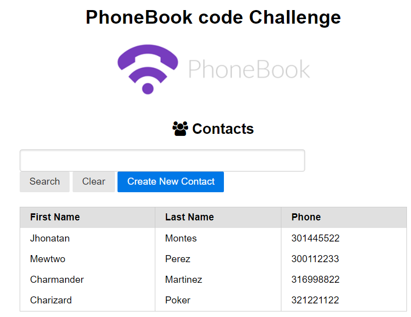

# PhoneBook Challenge
Springboot phonebook Challenge.
Contacts manager project.

#Technologies
- Springboot
- Spring Data with JPA  
- AWS (Amazon Web Service) Cloud hosting for the Data Base
- Postgresql
- Thymeleaf (Front HTML5 JVM web development) https://www.thymeleaf.org/

Requirements
====

- Java 8.
  -
- Checkout and run: mvn spring-boot:run
- Once running go to http://localhost:8080/

Use this Url to review the API documentation : [Local API Documentation - Swagger](http://localhost:8080/swagger-ui.html)

